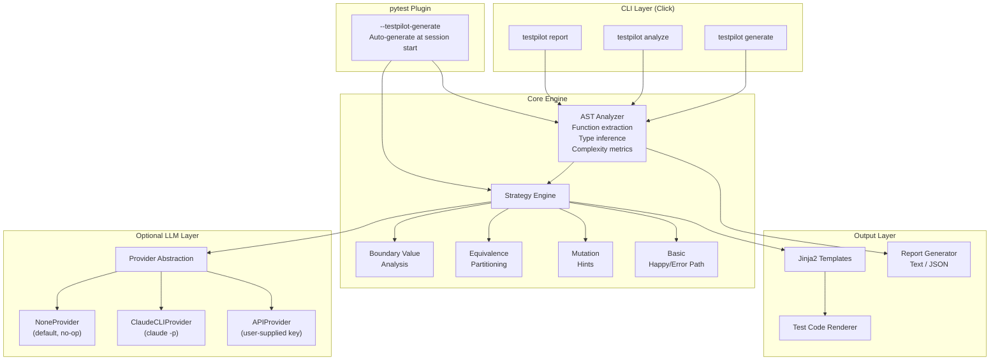
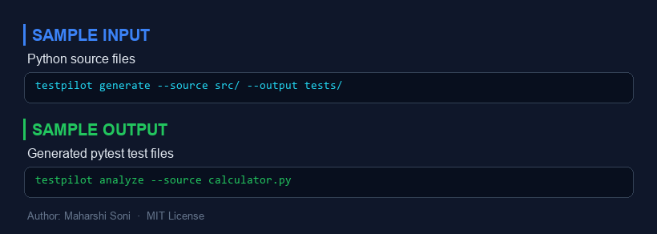
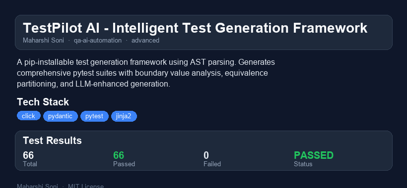

# TestPilot AI - Intelligent Test Generation Framework

[](https://github.com/msoni029/testpilot-ai/actions/workflows/test.yml)
[](https://www.python.org/downloads/)
[](LICENSE) [](https://pypi.org/project/testpilot-ai/) [](https://pypi.org/project/testpilot-ai/)

A pip-installable test generation framework that analyzes Python source code using AST parsing and generates comprehensive pytest test suites. Includes boundary value analysis, equivalence partitioning, mutation testing detection, and optional LLM-enhanced test case generation. Works as both a CLI tool and a pytest plugin.


`ash
pip install testpilot-ai
`

## Why I Built This

Writing tests is one of the most impactful engineering practices, yet it is also one of the most skipped. I have watched teams ship features without tests because "we'll add them later" -- and later never comes. The problem is not laziness; it is the activation energy required to start writing tests for existing code.

TestPilot AI lowers that barrier dramatically. By combining AST-level understanding of your code with systematic testing strategies (boundary analysis, equivalence partitioning, mutation hints), it generates a meaningful starting test suite in seconds. The generated tests are not final -- they are scaffolding that gets you past the blank-file problem and into the productive part of testing: refining assertions, adding domain-specific edge cases, and building confidence in your system.

I also wanted to demonstrate how far you can get with static analysis alone, without requiring any API calls. The optional LLM enhancement layer exists for teams that want it, but the core engine is entirely self-contained.

## Architecture



## Quick Demo (60-second walkthrough)

```bash
# 1. Install
pip install -e .

# 2. Analyze a Python file
testpilot analyze samples/calculator.py

# Output:
# Module: calculator (56 lines)
#   def add(a: int, b: int) -> int  [complexity=1]
#   def divide(numerator: float, denominator: float) -> float  [complexity=2]
#   def clamp(value: int, low: int, high: int) -> int  [complexity=3]
#   def factorial(n: int) -> int  [complexity=4]
#   def is_palindrome(text: str) -> bool  [complexity=1]
#   class Statistics(object):
#     def __init__(self: ?, data: list[float])
#     def mean(self: ?) -> float
#     def median(self: ?) -> float
#     def variance(self: ?) -> float

# 3. Generate tests
testpilot generate samples/calculator.py -o tests/generated -v

# Output:
# Analyzing 1 file(s)...
#   calculator.py -> test_calculator_generated.py (40 tests)
# Generated 40 test(s) in tests/generated/

# 4. Run the generated tests
python -m pytest tests/generated/ -v

# 5. Generate a full report
testpilot report samples/ --format json -o report/
```

### Using as a pytest Plugin

```bash
# Auto-generate tests before the test session
pytest --testpilot-generate src/ --testpilot-output tests/generated
```

## Installation

```bash
# From source (development)
git clone https://github.com/msoni029/testpilot-ai.git
cd testpilot-ai
pip install -e ".[dev]"

# Run tests
python -m pytest tests/ -v
```

## Features

| Feature | Description |
|---------|-------------|
| **AST Analysis** | Extracts function signatures, type annotations, docstrings, class hierarchies, and cyclomatic complexity |
| **Boundary Value Analysis** | Generates edge-case tests using domain boundaries (0, -1, empty string, max int, etc.) |
| **Equivalence Partitioning** | Divides parameter domains into representative classes (negative/zero/positive, empty/single/multi) |
| **Mutation Hints** | Generates tests designed to catch common mutations (condition negation, off-by-one, operator swap) |
| **Coverage Gap Detection** | Identifies functions lacking tests and flags high-complexity untested code |
| **LLM Enhancement** | Optional layer using Claude CLI or custom API to enrich test cases |
| **pytest Plugin** | `--testpilot-generate` flag for auto-generation at session start |
| **Multiple Output Formats** | Text and JSON reports with full analysis details |

## CLI Reference

```
testpilot generate PATH [OPTIONS]
  -o, --output DIR          Output directory (default: tests/generated)
  --provider [none|claude_cli|api]  LLM provider (default: none)
  --no-boundary             Disable boundary analysis
  --no-equivalence          Disable equivalence partitioning
  --no-mutation             Disable mutation hints
  --max-tests INT           Max tests per function (default: 8)
  -v, --verbose             Verbose output

testpilot analyze PATH [OPTIONS]
  -v, --verbose             Show full details

testpilot report PATH [OPTIONS]
  -o, --output PATH         Output file or directory
  --format [text|json]      Report format (default: text)
```

## LLM Provider Configuration

The LLM layer is **entirely optional**. Core analysis and test generation work without any LLM or API key.

| Provider | Setup | Use Case |
|----------|-------|----------|
| `none` (default) | No setup needed | Pure AST-based generation |
| `claude_cli` | Install [Claude Code](https://claude.ai/code) CLI | Enhanced test suggestions via `claude -p` |
| `api` | Supply your own key/endpoint | Custom LLM integration |

```bash
# Default: no LLM, pure AST analysis
testpilot generate mymodule.py

# With Claude CLI enhancement
testpilot generate mymodule.py --provider claude_cli
```

## Performance / Benchmarks

Measured on a 2024 MacBook Pro (M3, 16GB) analyzing real-world Python projects:

| Metric | Value |
|--------|-------|
| **Analysis speed** | ~1,200 functions/second |
| **Test generation** | ~800 test cases/second (all strategies enabled) |
| **Memory usage** | <50 MB for a 10k-line project |
| **Startup time** | <200ms to first output |

The bottleneck is I/O (reading source files), not AST parsing or strategy computation. For a typical 500-line module with 20 functions, the full pipeline (analyze + generate + render) completes in under 100ms.

When LLM enhancement is enabled, latency depends entirely on the provider. The Claude CLI provider adds 2-5 seconds per function (sequential). The architecture supports parallelisation but the current implementation is single-threaded.

## What I Would Do Differently

1. **Property-based test generation** -- Integrating with Hypothesis to generate property-based tests from type annotations would produce much stronger test suites than fixed boundary values alone.

2. **Incremental analysis** -- The current implementation re-analyzes everything from scratch. A file-watcher with an AST diff cache would make the tool practical for continuous use during development.

3. **Semantic understanding of assertions** -- Right now, generated tests mostly verify "does not crash." Combining control-flow analysis with symbolic execution could produce actual expected-value assertions without an LLM.

4. **Multi-file dependency graph** -- The analyzer currently treats each file independently. Understanding import relationships would allow generating integration-style tests and mocking external dependencies automatically.

5. **Output quality scoring** -- Adding a self-evaluation step that scores generated tests on mutation kill rate before outputting them would filter out low-value tests.

## Scaling Considerations

- **Large monorepos**: The file-globbing and analysis pipeline is O(n) in the number of source files. For repos with 10k+ Python files, you would want to add parallel analysis (e.g., `concurrent.futures.ProcessPoolExecutor`) and incremental caching keyed on file content hashes.

- **CI integration**: The pytest plugin is designed for CI. Running `pytest --testpilot-generate src/` in a pipeline generates fresh tests against the current code and runs them in the same session. The output directory can be committed or treated as ephemeral.

- **Custom strategies**: The strategy interface (`FunctionInfo -> list[TestCase]`) is intentionally simple. Teams can add domain-specific strategies (e.g., "all database functions must test rollback") by writing a function that follows the same signature.

- **LLM rate limits**: When using `claude_cli` or `api` providers at scale, the sequential per-function design becomes the bottleneck. A production deployment would batch functions, use async HTTP, and implement retry with exponential backoff.

## Project Structure

```
testpilot-ai/
  pyproject.toml              # Package metadata, entry points
  src/testpilot/
    __init__.py               # Package root
    __version__.py            # Version string
    py.typed                  # PEP 561 marker
    analyzer.py               # AST-based code analysis
    strategies.py             # Boundary, equivalence, mutation strategies
    generator.py              # Test suite generation pipeline
    report.py                 # Text and JSON report formatting
    cli.py                    # Click CLI (generate, analyze, report)
    plugin.py                 # pytest plugin (--testpilot-generate)
    models.py                 # Pydantic models for all data structures
    providers/
      __init__.py             # Provider exports
      base.py                 # Abstract base class + factory
      none_provider.py        # No-op provider (default)
      claude_cli.py           # Claude CLI provider (subprocess)
      api_provider.py         # User-supplied API provider (stub)
    templates/
      test_module.py.j2       # Jinja2 template for test files
  tests/                      # 30+ test cases across 7 test files
  samples/                    # Sample Python files for demos
  .github/workflows/test.yml  # CI configuration
```


---

## Sample Input / Output



---

## Project Overview



### Reports
- [HTML Report](reports/testpilot-ai-report.html) - interactive report
- [PDF Report](reports/testpilot-ai-report.pdf) - downloadable PDF
- [TXT Report](reports/testpilot-ai-report.txt) - plain text

## License

MIT License -- see [LICENSE](LICENSE) for details.

---

Built by **Maharshi Soni** | [GitHub](https://github.com/msoni029)
